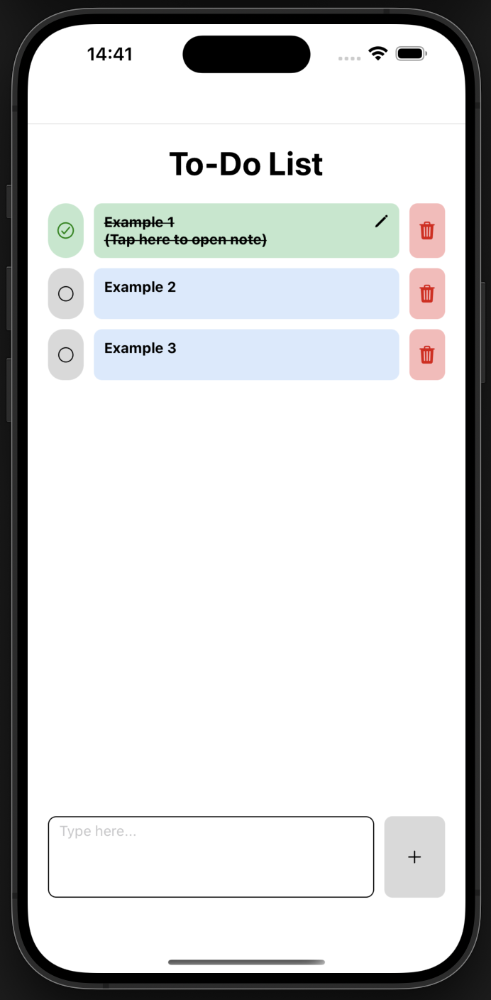

# Welcome to To-Do List app 👋

Welcome to To-Do List app! This project is a simple and intuitive To-Do List application built with Expo and React Native. It helpyou efficiently manage your daily tasks, allowing you to add new items, mark them as complete, and remove them when no longer neededAll your data is conveniently persisted in local storage, so your tasks are saved even after you close the app.

 
   

## 💻 Technologies Stack

- Expo
- React Native
- CSS

## ⚡ Features

- Add Items: Add new tasks by creating a topic. If you want to add more detailed content, you can tap on the note section.
- Mark as Complete: Mark completed tasks.
- Delete Items: Remove unwanted tasks from the list.
- Data Storage: Data will be stored in local storage.

## 👨‍💻 Installation

To install and run the project locally, follow these steps:

- Clone the repository: `git clone https://github.com/Ssrch025/to-do-list.git`
- Navigate to the project directory: `cd to-do-list`
- Install the dependencies: `npm install`
- Start the development server: `npm run start`

## 📝 License

This project is licensed under the terms of the MIT License.
